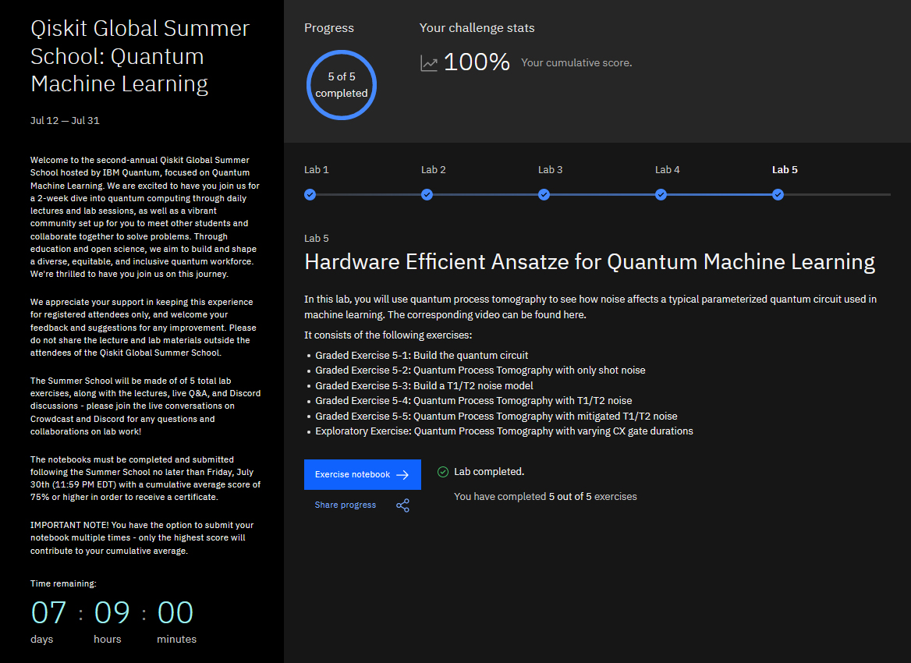

  
  
# Qiskit Global Summer School 2020  
  
These are the labs I did as part of the [Qiskit Global Summer School (QGSS) 2021](https://challenges.quantum-computing.ibm.com/qgss21)  
  
## Summer School Details  
__Site:__ [Qiskit](https://challenges.quantum-computing.ibm.com/qgss21)  
__Date:__ July 2021  
  
## Certificate  
Here's a screenshot of my summer school dashboard  
  
  
## Description  
The labs are contained in `lab-x.ipynb` in each folder.  
The notebooks are also saved as html for easier reference.  
  
## Topics  
`lab-1` - Quantum Computing Operations and Algorithms  
`lab-2` - Variational Algorithms  
`lab-3` - Quantum Feature Maps, Kernels and Support Vector Machines  
`lab-4` - Training Quantum Circuits  
`lab-5` - Hardware Efficient Ansatze for Quantum Machine Learning  